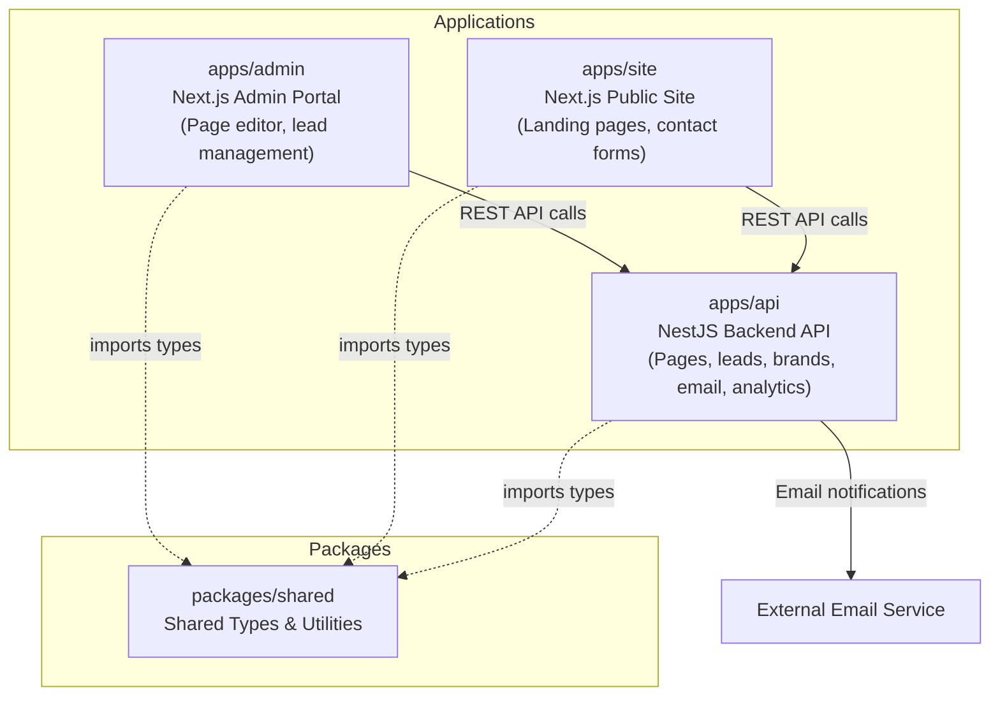

# Publication Platform — Engineering Assessment

## Assessment Overview

You're joining a team maintaining a brand publication and lead management platform. The codebase has been under active development with high feature velocity. Some areas have accumulated structural debt.

This is a **video-based live assessment**. You will share your screen, narrate your thinking, and work through the tasks below. The entire session is recorded.

**AI tools are permitted and encouraged**, but you must narrate what you accept, reject, and verify from AI output. Treating AI as an oracle rather than a tool is a negative signal.

## Architecture



| App | Responsibility |
|-----|----------------|
| `apps/api` | NestJS backend — pages CRUD, lead capture, brand management, email dispatch, analytics tracking |
| `apps/admin` | Next.js admin portal — page editor, lead management dashboard, brand configuration |
| `apps/site` | Next.js public site — renders landing pages, deep dives, contact forms for lead capture |
| `packages/shared` | Shared TypeScript types and utilities consumed by all three apps |

## Setup Instructions

```bash
pnpm install
pnpm dev
```

| Service | URL | Description |
|---------|-----|-------------|
| Admin | http://localhost:3000 | Admin portal |
| API | http://localhost:3001 | Backend REST API |
| Site | http://localhost:3002 | Public site |

## Assessment Flow (Video-Based)

### Phase 1 — Exploration (15 min)

Read the codebase on screen. Think aloud. Produce a **diagnosis memo** covering:

- Architecture sketch — how the pieces fit together
- Likely hotspots — where problems concentrate
- Suspected root causes — what mechanisms produce the reported bugs
- Risk areas — what could break next

**No coding in this phase.** The goal is to demonstrate that you build a mental model before touching code.

### Phase 2 — Implementation (45-60 min)

Fix the bug. Add the feature. Refactor where your judgment says it is needed. Narrate your decisions as you work.

### Phase 3 — Defense (15-20 min)

Explain what you did, what you left untouched, and what risks remain. Describe how you used AI tools and what you accepted or rejected from their suggestions.

## Problem Statement

### Bug Report

> Users report that editing content sections on one landing page sometimes corrupts content on a completely different page. This happens most often when pages were created from a template. The issue is intermittent and hard to reproduce in dev.

### Feature Request

> Add UTM parameter capture to the public site contact form. When a visitor arrives via a marketing link (e.g., `?utm_source=google&utm_medium=cpc`), the UTM values should be stored with the lead record so brand managers can see which campaigns drive leads. UTM data should NOT appear in user-visible notes.

These are the primary tasks, but a strong candidate will identify and address related issues they discover during exploration.

## Solution

### 1) What was the bug

Editing content on one landing page could change or “corrupt” sections on **another** page. It showed up most often for pages created from a **template** (or cloned from another page). The failure looked random because it depended on whether two pages still pointed at the same underlying section data.

### 2) How we identify the bug

We traced page creation and section updates in the API (`apps/api`). New pages created with `templateId` are built in `PagesService._cloneFromTemplate`. That code spread the template page into a new object but reused **`sections: template.sections`** — the same array and the same `Section` instances as the template. Section updates use `updateSection`, which mutates `section.content` in place (`Object.assign`). So any edit on one page affected every page that shared those section objects. Template-based flows were the smoking gun because they always went through `_cloneFromTemplate`.

### 3) How we solve the bug

We stop sharing section data across pages. `_cloneFromTemplate` now assigns **`sections` from a deep copy** of the template’s sections: each section gets a **new id**, and **`content` is cloned** (e.g. with `structuredClone`) so mutations are isolated per page. Implementation lives in `PagesService._cloneSectionsFromTemplate` in `apps/api/src/pages/pages.service.ts`.

**UTM capture (related feature):** The public contact form appends current `utm_*` query parameters to `POST /leads`, and the API merges them into `lead.metadata` only — not into user-visible `notes`. See `apps/site/src/lib/api.ts`, `apps/site/src/components/ContactForm.tsx`, and `submitLead` in `pages.service.ts`.

## Evaluation Criteria

See [docs/EVALUATION-CRITERIA.md](docs/EVALUATION-CRITERIA.md) for the full rubric.

## Rules

- **Time limit**: 90 minutes total
- **AI usage**: Permitted. You MUST narrate what you accept, reject, and verify from AI suggestions.
- **Scope**: You are not expected to fix everything. Prioritize what matters most.
- **Refactoring**: You may refactor, but explain why.

## Additional Documentation

- [Architecture Guide](docs/ARCHITECTURE.md)
- [Evaluation Criteria](docs/EVALUATION-CRITERIA.md)
